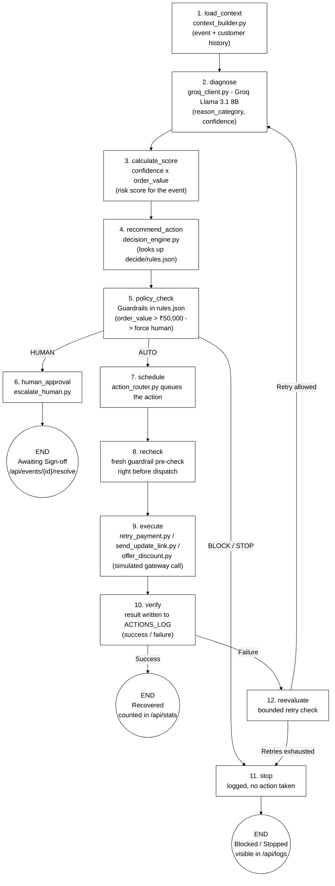
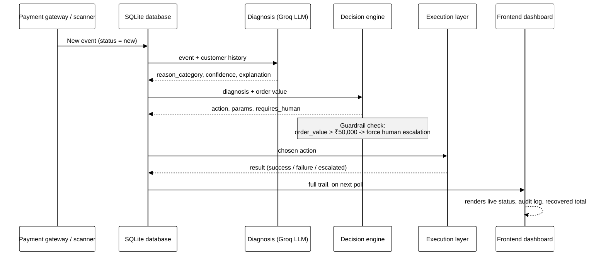
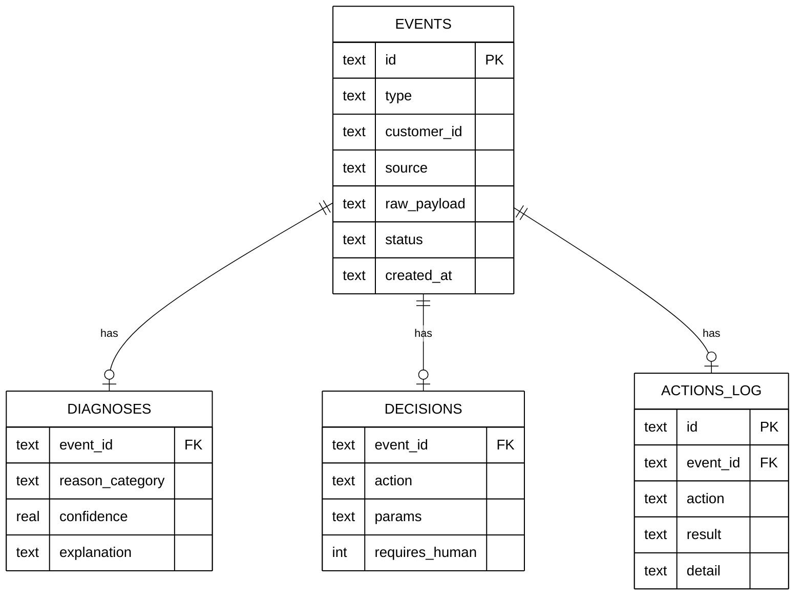

# Revenue Recovery Agent

An autonomous agent that detects revenue at risk — payment failures, checkout abandonment, subscription lapses, and overdue receivables — diagnoses the root cause, decides on a **bounded** intervention, and executes the recovery action automatically.

Built for [Buildathon Name] · [Live Demo](#) · [Video Walkthrough](#)

---

## The problem

Revenue leaks in disconnected moments across a business: a card gets declined, a checkout gets abandoned, a subscription silently fails to renew, an invoice goes unpaid. Today, a human has to notice each one, figure out why it happened, and manually decide what to do. This agent closes that loop — automatically, and with hard guardrails so it never acts outside defined limits.

---

## System architecture

Every event — a payment failure, an abandoned checkout, an overdue invoice — runs through this pipeline. It's normalized and given context, diagnosed by the LLM, scored, matched to a bounded action, and passed through a hard-coded guardrail check before anything is allowed to execute. Depending on risk, that action is either auto-scheduled, sent to a human for sign-off, or blocked outright. A scheduled action is re-checked immediately before dispatch, and if the gateway attempt fails, the event loops back into diagnosis for a bounded number of retries before the agent gives up and stops — every step of which lands in the audit log.



---

## How one event flows end to end

This is the core loop — every payment failure, abandoned checkout, or overdue invoice goes through exactly this sequence:



---

## Database schema



---

## Tech stack

| Layer | Technology | Why |
|---|---|---|
| Backend / API | FastAPI (Python) | Fast to build, async-friendly, auto-generated docs |
| Database | SQLite | Zero setup, portable, easy to inspect |
| Diagnosis (AI) | Groq API (Llama 3.1 8B) | Fast, free-tier inference for structured classification |
| Decision engine | Rules-based (`rules.json`) | Deterministic, inspectable, auditable guardrails |
| Execution | Simulated payment / messaging actions | Swappable for Razorpay / Stripe / Twilio in production |
| Frontend | HTML, Tailwind, vanilla JS | Live-polling dashboard, no build step |
| Hosting | Vercel / Render | Zero-config deploys |

---

## Project structure

```
revenue-recovery-agent/
├── orchestrator.py         # runs the full pipeline in one command
├── config.py                # loads environment variables & auto-seeds DB
├── requirements.txt
├── vercel.json              # Vercel serverless routing
│
├── api/
│   └── index.py             # serverless entrypoint
│
├── db/
│   ├── schema.sql            # table definitions
│   ├── seed_data.py           # test data
│   └── seed_invoices.py       # fake overdue invoices for the detector
│
├── detect/                   # PILLAR 1 — turns raw signals into events
│   ├── invoice_scanner.py
│   ├── cart_scanner.py
│   └── webhook_receiver.py
│
├── diagnose/                 # PILLAR 2 — classifies the root cause
│   ├── context_builder.py
│   ├── groq_client.py
│   └── run_diagnosis.py
│
├── decide/                   # PILLAR 3 — bounded decision engine
│   ├── rules.json             # every guardrail lives here, inspectable
│   ├── decision_engine.py
│   └── run_decision.py
│
├── execute/                  # PILLAR 4 — runs the recovery action
│   ├── action_router.py
│   ├── actions/
│   │   ├── retry_payment.py
│   │   ├── send_update_link.py
│   │   ├── offer_discount.py
│   │   └── escalate_human.py
│   └── run_execution.py
│
└── dashboard/                 # observability layer
    ├── api.py                  # serves /api/stats, /api/workflows, /api/logs
    └── frontend/
        └── index.html          # ARR corporate landing & multi-tab dashboard
```

---

## The guardrail model

The agent is deliberately **bounded**, not fully autonomous:

- Every possible action lives in a fixed, inspectable lookup table (`decide/rules.json`) — the agent cannot invent a new action
- Any event above a configurable threshold (e.g., ₹50,000) is automatically escalated to a human, overriding whatever the rules table would normally do
- Every diagnosis, decision, and executed action is written to an append-only audit log, queryable through `/api/logs`
- Failed actions never crash the pipeline — they're logged and surfaced, not silently dropped

---

## Running it locally

```bash
# 1. Clone and install
git clone https://github.com/balamuralidharnollu2-svg/AI-REVENUE.git
cd AI-REVENUE
pip install -r requirements.txt

# 2. Add your API key
cp .env.example .env
# edit .env and add GROQ_API_KEY=your_key

# 3. Create the database
python init_db.py
python db/seed_invoices.py
python db/seed_data.py

# 4. Run the full pipeline once
python orchestrator.py

# 5. Start the dashboard
python -m uvicorn dashboard.api:app --reload --port 5000
```
Then open `http://localhost:5000` in a browser.

---

## API reference

| Endpoint | Method | Purpose |
|---|---|---|
| `/api/stats` | GET | Total recovered revenue |
| `/api/workflows` | GET | Recent events with live status |
| `/api/logs` | GET | Chronological audit trail |
| `/api/simulate` | POST | Injects a fake event and runs it through the full pipeline |
| `/api/reset` | POST | Clears and re-seeds the database |
| `/api/events/{id}/resolve` | POST | Human-in-the-loop manual override |

---

## What's simulated vs. real in this build

Built for a hackathon timeframe — transparently:
- **Real:** detection logic, LLM-based diagnosis (Groq API), the rules-based decision engine, the guardrail threshold, the full database pipeline, the live dashboard
- **Simulated:** the actual payment gateway / SMS / email calls in `execute/actions/` — these return realistic success/failure outcomes but don't move real money or send real messages. Swapping in Razorpay/Stripe/Twilio credentials would make them real without changing any other layer.

---

## Roadmap

- [ ] Real payment gateway integration (Razorpay/Stripe live mode)
- [ ] Real webhook ingestion from a live checkout flow
- [ ] Persistent hosted database (Postgres) instead of SQLite
- [ ] Per-customer contact channel preferences (WhatsApp vs SMS vs Email)
- [ ] A/B testing different intervention strategies per diagnosis category
